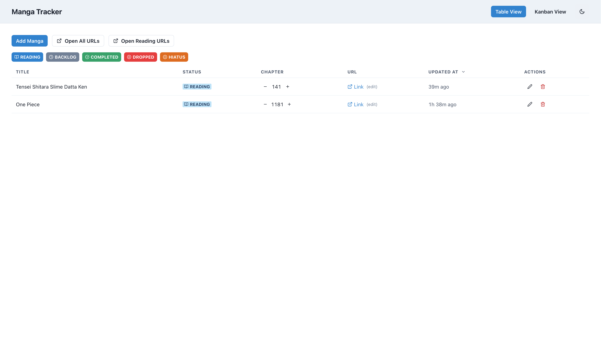
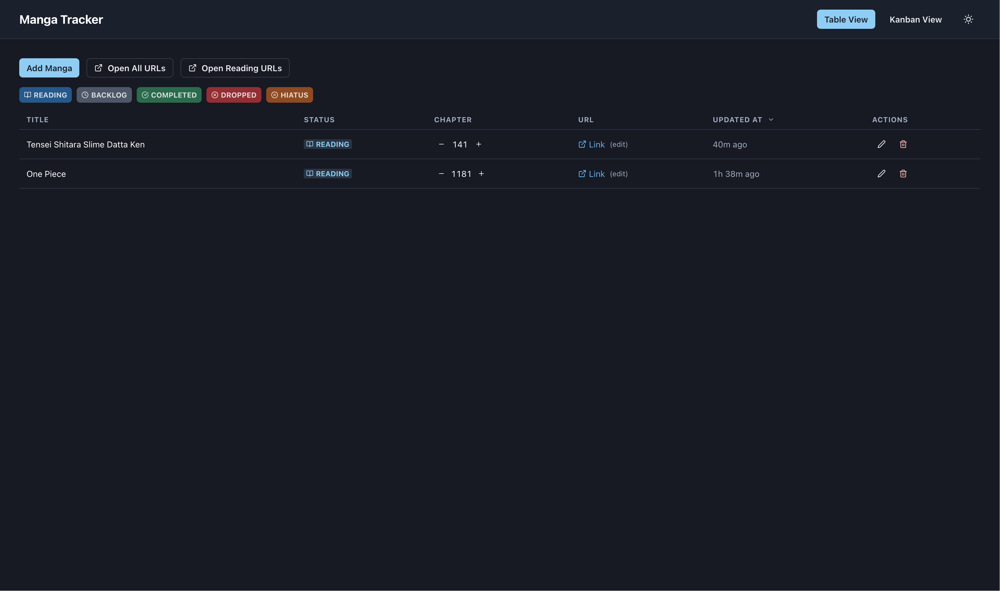
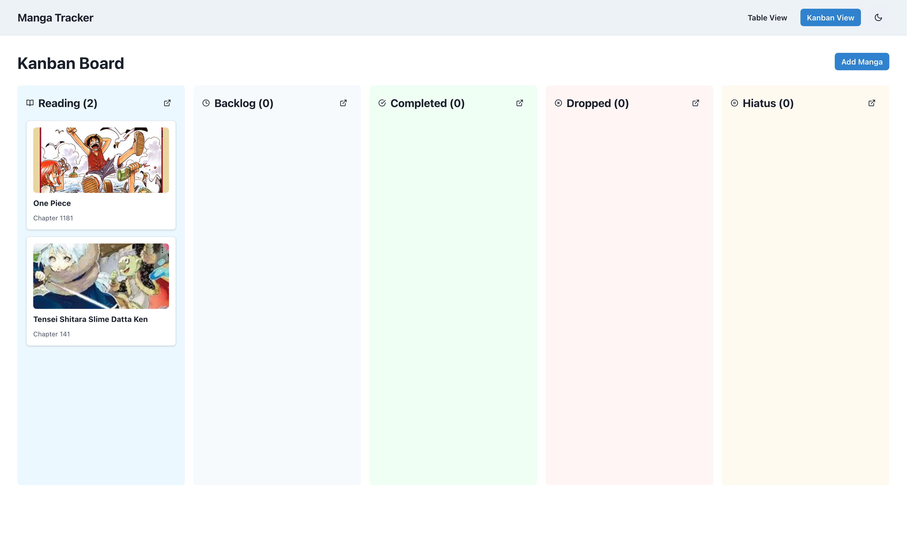
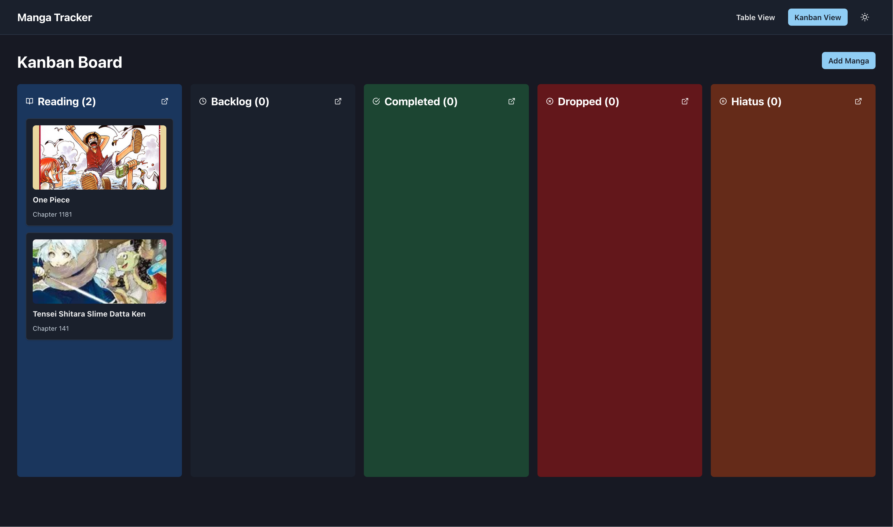

# Manga Tracker

A personal web app for tracking manga series across different reading statuses. Built with Go backend and React frontend, deployable as a single Docker/Podman image.

> **🤖 Built with AI:** This project was developed using GitHub Copilot's [grill-with-docs](https://github.com/mattpocock/skills/tree/main/skills/engineering/grill-with-docs) skill by [@mattpocock](https://github.com/mattpocock). The skill facilitates a systematic interview process to clarify requirements, sharpen terminology, and document decisions inline—resulting in a fully functional application with comprehensive documentation.

## Screenshots

### Table View (Light Mode)


### Table View (Dark Mode)


### Kanban View (Light Mode)


### Kanban View (Dark Mode)


## Initial Prompt

```
We are starting a new greenfield project. This is going to be a golang and typescript react with 
chakra ui v3 project. We are going to deploy it as a single docker image that would run on any 
machine. We should be able to run the application (Backend and frontend) normally without building 
a image. Database is a sqlite. You should run, build, lint(format), clean, db-reset(rename the 
current db with timestamp and then creates a new one) by using Makefile for the backend. and npm 
run dev,format,build for the frontend. Use Vite, use biome. We should skills and instructions 
inside the repository for work where it fits (e.g., makefile, npm run *, chakra-ui v3, sqlite, 
and many more), instructions on how to verify the code (tdd + lint). We are serving the frontend 
through a go-service instead of nginx for the deployment. We can start the project tasks with 
setting up agents skills (./.agents/skills/<skill>/SKILL.md) and instruction 
(./.github/instructions/<instructions-slug>.md), then the makefile, vite, dockerfile with a single 
image (backend, serve, frontend), then the project itself. The scope of the project, "Manga Tracker" 
is a web-app that help me keep track of different manga series I'am reading.
```

### From Prompt to Documentation

The **grill-with-docs** skill transformed this initial prompt into comprehensive documentation through a systematic interview process:

**Phase 1: Requirements Clarification (14 Questions)**
- State transition rules (allow all transitions)
- Data types and validation (integer chapters, 5 status types)
- Image handling approach (local storage, not S3)
- Suggested readings logic (Reading status, 1+ week threshold)
- Bulk operations scope (open all vs. open by status)
- View preferences (both table and kanban)
- Deployment strategy (single Docker image with volumes)
- API design patterns (REST with standard CRUD)
- Authentication needs (none - single user)
- Testing approach (TDD with repository tests)

**Phase 2: Domain Modeling**
The clarifications resulted in:
- **[CONTEXT.md](./CONTEXT.md)** - Precise glossary defining Manga, Status types, Chapter semantics, Suggested Reading
- **ADR-0001** - Single Docker image with volume-mounted `/data/` for persistence
- **ADR-0002** - No authentication (single-user, network-secured deployment)
- **4-phase implementation plan** with 23 tracked todos

**Phase 3: Initial Implementation**
Following the plan from the grill session:
- Backend: Go REST API, SQLite schema, repository pattern, image upload handling
- Frontend: React with Chakra UI v2, table/kanban views, TanStack Query
- Infrastructure: Multi-stage Dockerfile, Makefile commands, comprehensive documentation
- Testing: 13 backend tests, all passing

**Beyond the Initial Plan: UI Enhancement Iterations**

After the core application was functional, multiple enhancement iterations followed:

1. **UI Modernization** (14 questions about design preferences)
   - Dark mode with localStorage persistence
   - Inline editing for all fields (title, chapter, status, URL)
   - Chapter +/- increment buttons for quick updates
   - Condensed table layout for better information density
   - React Icons (Feather set) replacing emojis

2. **Advanced Filtering & Navigation**
   - Multi-select status filter badges (inverted logic - click to hide)
   - Sortable column headers with URL query sync
   - Relative timestamps ("2h 30m ago", "3 days ago", "2 weeks ago")
   - Shareable URLs with filter/sort state

3. **Kanban Enhancements**
   - Clickable cards to open manga URLs
   - Three-dots menu (Edit/Delete)
   - Suggested manga indicators (bell icon + yellow highlight)
   - Column-level "Open All" buttons
   - Sort by oldest first (suggested manga at top)

4. **Polish & Security**
   - Cancel buttons and Escape key handling for inline edits
   - Comprehensive dark mode color fixes (8 issues resolved)
   - Custom logo/favicon (reading progress gauge design)
   - Security audit (no secrets, proper .gitignore, clean git history)
   - Font size refinements for better readability

**Result:** A production-ready application with 60 completed todos, comprehensive documentation (CONTEXT.md, 2 ADRs, 6 skills, 3 instruction guides), and polished UX far beyond the initial scope.

## Contributing

This is a personal project built for learning and demonstration purposes. While you're welcome to fork it and adapt it for your own use, **I'm not actively seeking contributions or pull requests**.

If you find this project useful or interesting, feel free to:
- ⭐ Star it
- 🍴 Fork it and make it your own
- 📖 Use it as a learning resource
- 💡 Draw inspiration for your own projects

For questions or discussions, feel free to open an issue, but please note response times may vary.

## License

MIT License - see [LICENSE](./LICENSE) file for details.

This project is provided as-is for personal use, learning, and demonstration. Use at your own risk.


## Features

- **Track Manga**: Title, cover image, URL, reading status, current chapter
- **Multiple Statuses**: Reading, Backlog, Completed, Dropped, Hiatus
- **Two Views**:
  - **Table View**: Condensed, sortable list with inline editing, status filter badges, relative timestamps
  - **Kanban View**: Drag-and-drop cards with suggested manga indicators and column bulk actions
- **Inline Editing**: Click to edit title, chapter (with +/- buttons), status, and URL directly in the table
- **Status Filtering**: Multi-select badge filters with URL query sync (shareable links)
- **Suggested Readings**: Automatic alerts for Reading manga not updated in 7+ days
- **Bulk Actions**: Open all URLs or Reading-only manga in browser tabs
- **Dark Mode**: Full dark mode support with localStorage persistence and theme toggle
- **Image Management**: Upload and store cover images locally
- **Offline-First**: No external dependencies, runs anywhere

## Tech Stack

**Backend:**
- Go 1.21+
- SQLite database
- REST API

**Frontend:**
- React 19 with TypeScript
- Chakra UI v2 (with dark mode support)
- Vite for dev/build
- TanStack Query for server state
- React Icons (Feather set)
- @dnd-kit for drag-and-drop
- Biome for linting/formatting

## Local Development

### Prerequisites

- Go 1.21+
- Node.js 18+
- make

### Setup

1. Clone the repository:
```bash
git clone <repo-url>
cd manga-tracker
```

2. Start the backend:
```bash
cd backend
make run
```
Backend runs on http://localhost:8080

3. In another terminal, start the frontend:
```bash
cd frontend
npm install
npm run dev
```
Frontend runs on http://localhost:5173

### Backend Commands (via Makefile)

```bash
cd backend

make run        # Start development server
make build      # Build binary
make test       # Run tests
make format     # Format and lint code
make clean      # Remove build artifacts
make db-reset   # Backup and reset database
```

### Frontend Commands

```bash
cd frontend

npm run dev     # Start dev server
npm run build   # Build for production
npm test        # Run tests
npm run format  # Format and lint with Biome
```

## Production Deployment

### Using Docker/Podman

1. Build the image:
```bash
# With Docker
docker build -t manga-tracker .

# With Podman
podman build -t manga-tracker .
```

2. Run the container:
```bash
# With Docker
docker run -d \
  -p 8080:8080 \
  -v $(pwd)/data:/data \
  --name manga-tracker \
  manga-tracker

# With Podman
podman run -d \
  -p 8080:8080 \
  -v $(pwd)/data:/data \
  --name manga-tracker \
  manga-tracker
```

3. Access at http://localhost:8080

The `/data` volume contains:
- `manga.db` - SQLite database
- `images/` - Uploaded cover images

### Manual Deployment

1. Build frontend:
```bash
cd frontend
npm install
npm run build
```

2. Build backend:
```bash
cd backend
make build
```

3. Run backend (serves both API and frontend):
```bash
cd backend
DATA_DIR=/path/to/data PORT=8080 ./bin/manga-tracker
```

## Project Structure

```
.
├── backend/               # Go backend
│   ├── cmd/              # Application entrypoint
│   ├── internal/         # Internal packages
│   │   ├── api/         # HTTP handlers
│   │   ├── database/    # DB initialization
│   │   └── manga/       # Domain models
│   ├── Makefile         # Development commands
│   └── go.mod
├── frontend/             # React frontend
│   ├── src/
│   │   ├── api/         # API client
│   │   ├── components/  # Reusable components
│   │   ├── features/    # Feature modules
│   │   └── types/       # TypeScript types
│   ├── vite.config.ts
│   ├── biome.json       # Linter config
│   └── package.json
├── docs/
│   └── adr/             # Architecture Decision Records
├── .github/instructions/ # Development guides
├── .agents/skills/      # Agent skill documentation
├── CONTEXT.md           # Domain language glossary
├── Dockerfile           # Production image
└── README.md
```

## API Endpoints

- `GET /api/manga` - List all manga
- `POST /api/manga` - Create new manga
- `GET /api/manga/:id` - Get single manga
- `PUT /api/manga/:id` - Update manga
- `DELETE /api/manga/:id` - Delete manga
- `GET /api/manga/suggested` - Get suggested readings

## Testing

**Backend:**
```bash
cd backend
make test
```

**Frontend:**
```bash
cd frontend
npm test
```

See [TDD Workflow](.github/instructions/tdd-workflow.md) for development practices.

## Documentation

- [CONTEXT.md](./CONTEXT.md) - Domain language and concepts
- [Architecture Decisions](./docs/adr/) - Key technical choices
- [Verification Guide](.github/instructions/verification.md) - How to verify changes
- [Linting Guide](.github/instructions/linting.md) - Code quality tools
- [TDD Workflow](.github/instructions/tdd-workflow.md) - Test-driven development

## Skills Documentation

Agent-friendly guides for common tasks:
- [Makefile](.agents/skills/makefile/SKILL.md)
- [Vite](.agents/skills/vite/SKILL.md)
- [Chakra UI](.agents/skills/chakra-ui-v3/SKILL.md)
- [Biome](.agents/skills/biome/SKILL.md)
- [SQLite](.agents/skills/sqlite/SKILL.md)
- [TDD](.agents/skills/tdd/SKILL.md)

## UI Features

### Table View
- **Inline Editing**: Click any field to edit directly (title, chapter, status, URL)
- **Chapter Controls**: +/- buttons appear on hover for quick updates
- **Status Filter Badges**: Click to hide/show statuses (inverted filtering with strikethrough)
- **Sortable Headers**: Click column headers to sort by title or updated time
- **URL Query Sync**: Filters and sorting persist in URL (shareable links)
- **Relative Timestamps**: Human-readable time since last update ("2h 30m ago", "3 days ago")
- **Condensed Layout**: Optimized row height and spacing for efficient scanning
- **Cancel Buttons**: Escape key or red X button to cancel inline edits

### Kanban View
- **Drag-and-Drop**: Move cards between status columns
- **Clickable Cards**: Click card to open manga URL in new tab
- **Three-Dots Menu**: Always-visible menu for Edit/Delete actions
- **Suggested Indicators**: Bell icon + yellow highlight for 1+ week old Reading manga
- **Column Sorting**: Oldest manga appear first (suggested at top)
- **Open All Button**: Bulk-open all URLs in a column
- **Status Icons**: Visual icons in column headers (book, clock, check, X, pause)

### Dark Mode
- **Toggle Button**: Sun/moon icon in navigation bar
- **Persistent**: Saved to localStorage
- **Full Coverage**: All components adapt properly to dark theme
- **Custom Logo**: Minimal design optimized for both light and dark modes

## Development Story

This project was built iteratively using the [grill-with-docs](https://github.com/copilot-extensions/grill-with-docs-skill) approach:
1. **Requirements Clarification** (14 design questions)
2. **Domain Modeling** (CONTEXT.md + ADRs)
3. **Parallel Implementation** (Backend + Frontend agents)
4. **UI Enhancement Phase** (Dark mode, inline editing, condensed layouts)
5. **Security Audit** (No secrets, proper .gitignore, clean git history)

## License

Personal project - use as you wish.

